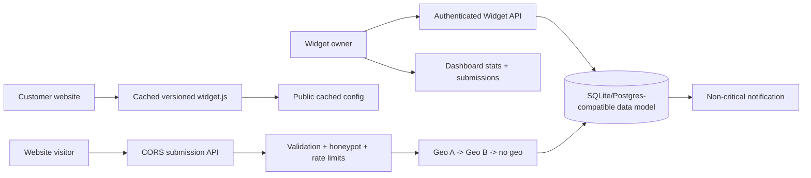

# Embeddable Widget & Lead-Capture Platform

A Python/FastAPI capstone that lets an authenticated owner create tenant-isolated widgets, ship them with one script tag, accept cross-origin leads safely, enrich IPs with a fallback chain, and inspect submissions.

## Architecture



The customer demo is deliberately a separate-origin static page (`demo/`). The API uses SQLite by default so it runs without paid infrastructure; the schema is portable to PostgreSQL with minimal adapter work.

## Run locally

```bash
python3 -m venv .venv && source .venv/bin/activate
pip install -r requirements.txt
cp .env.example .env
uvicorn app.main:app --reload --port 8000
# second origin, in another terminal:
python3 -m http.server 5500 --directory demo
```

Open `http://localhost:5500`. Seed credentials are `owner@example.com / owner-password`; a second tenant is `other@example.com / other-password`. Never use these credentials in production.

## API quick reference

| Method | Endpoint | Auth | Purpose |
|---|---|---:|---|
| POST | `/auth/login` | No | Issue a bearer token |
| GET/POST | `/widgets` | Yes | List/create widgets |
| GET/PUT/DELETE | `/widgets/{id}` | Yes | Tenant-scoped CRUD |
| GET | `/widgets/{id}/embed` | Yes | Generate one-line script |
| GET | `/widgets/{id}/config` | No | Small cached public config |
| GET | `/widget.js?v=1&id={id}` | No | Versioned cached bundle |
| POST | `/submissions` | No | CORS visitor submission |
| GET | `/dashboard/submissions` | Yes | Owner's submissions |
| GET | `/dashboard/stats` | Yes | Counts and geo breakdown |

Interactive OpenAPI documentation is available at `/docs`. Public submission bodies look like `{"widget_id":"demo","data":{"email":"a@b.com"},"website":""}`. The hidden `website` field is a honeypot; non-empty values return 422. Oversized fields and payloads are rejected by Pydantic validation.

## Resilience controls

The in-process limiter demonstrates per-IP and per-widget burst protection and returns 429. `GEO_PROVIDER_MODE=mock` represents provider A; `provider_a_down` deterministically uses provider B; `all_down` returns no geo while still storing the lead. `SIDE_EFFECT_MODE=fail` simulates a notification outage and proves the main response remains 201.

## Tests

```bash
pytest -q
```

## Explicit non-goal

This capstone does not implement a production visual form builder, billing, real CDN, email provider, or multi-region deployment. The focus is secure public API boundaries and graceful degradation.
